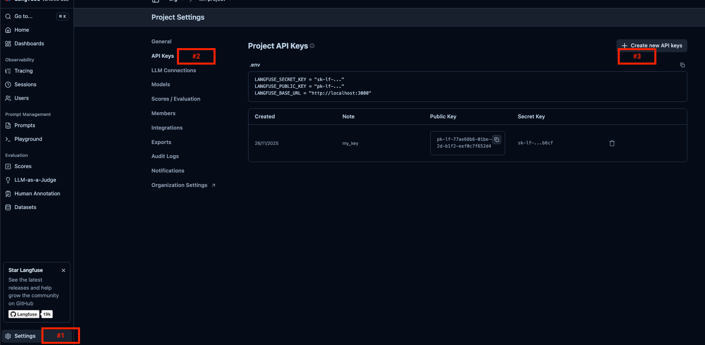
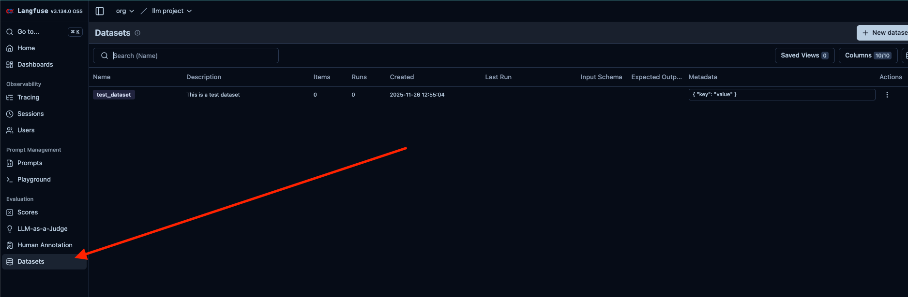

# Setting Up Langfuse

### 1. Start Langfuse with Docker

Navigate to the `langfuse` directory and start the services:
```bash
git clone https://github.com/langfuse/langfuse.git
cd langfuse
docker compose up
```

If you encounter a port conflict error:
```bash
# Linux/Mac
lsof -i :9000
kill -9 <PID>

# Windows
netstat -ano | findstr :9000
taskkill /PID <PID> /F
```

**Note:** The langfuse folder is created when cloning the repository. See the [official documentation](https://langfuse.com/self-hosting/deployment/docker-compose) for details.

Once running, access the Langfuse UI at http://localhost:3000.

### 2. Configure Langfuse Connection



Set up your API credentials:

1. Navigate to http://localhost:3000 and create a new project
2. Go to **Settings** → **API Keys**
3. Click **Create New API Key**
4. Copy the public key, secret key, and base URL
5. Add these credentials to a `.env` file in the project root (refer to `.env.example` for the format)

### 3. Test Langfuse Connection

Verify your setup by running:
```bash
uv run python check_langfuse_setup.py
```

Expected output:
```
Langfuse client is authenticated and ready!
Dataset created: test_dataset
```

Confirm the dataset creation in the Langfuse UI:

